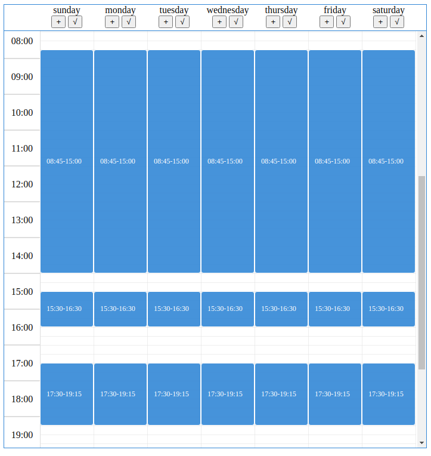

# 开源日历组件介绍

在线演示地址：[Calendar](https://beautifulhao.github.io/drag-calendar/iframe.html?id=example-calendar--default-calendar&viewMode=story)

## 组件基本功能

组件模仿google日历，主要用于设置一周营业时间的场景。每天的时间段可以通过下边缘resize，可以通过整体拖动位移实现时间段位置调整。

## 使用技术
- React
- Typescript
- SCSS
- StoryBook
- Fontawesome

## 你可以通过以下命令运行组件

### `yarn install`

安装项目依赖

### `yarn doc`

运行文档示例

### `yarn build`

打包项目

## 源码地址
Getee:` https://gitee.com/BeautifulHao/calendar.git `